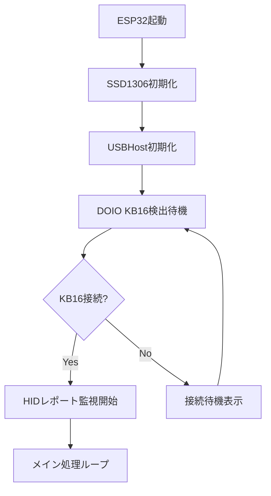
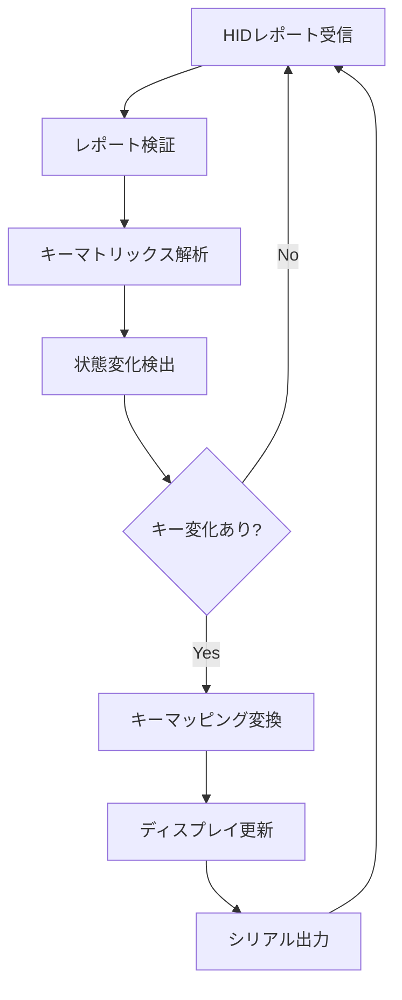

# DOIO KB16 USB-SSD1306 表示システム

XIAOESP32のUSBHost機能を使用してDOIO KB16キーボードの入力を取得し、SSD1306 OLEDディスプレイに表示するシステムです。

## 概要

このプロジェクトは、DOIO KB16マクロキーボードをXIAOESP32に接続し、キー入力をリアルタイムでSSD1306ディスプレイに表示します。Python版のHIDレポートアナライザーを参考に、C++で実装されています。

## 機能要件

### 1. ハードウェア要件

#### 必須ハードウェア
- **XIAOESP32 (ESP32-S3)**: USBHost機能搭載
- **DOIO KB16**: 4x4マトリックスマクロキーボード
  - VID: 0xD010
  - PID: 0x1601
  - 16バイトHIDレポート形式
- **SSD1306 OLED**: 128x64ピクセル、I2C接続
- **USB-Cケーブル**: DOIO KB16とXIAOESP32接続用

#### 接続構成
```
DOIO KB16 ──USB-C──→ XIAOESP32 ──I2C──→ SSD1306
                         │
                         └── シリアル出力（デバッグ用）
```

### 2. ソフトウェア要件

#### 開発環境
- **PlatformIO**: ESP32開発環境
- **Arduino Framework**: ESP32-S3対応
- **USB Host Library**: ESP32-S3 USBHost機能
- **SSD1306ライブラリ**: OLEDディスプレイ制御

#### 依存ライブラリ
```ini
lib_deps = 
    adafruit/Adafruit SSD1306@^2.5.7
    adafruit/Adafruit GFX Library@^1.11.5
    espressif/arduino-esp32@^2.0.0
```

### 3. 機能仕様

#### 3.1 USB Host機能
- **デバイス自動検出**: DOIO KB16の自動認識（VID/PID照合）
- **HIDレポート処理**: 16バイトレポートの解析
- **キーマッピング**: 4x4マトリックス（16キー）の状態管理
- **リアルタイム処理**: 低遅延でのキー入力検出

#### 3.2 HIDレポート解析
```cpp
// DOIO KB16 HIDレポート構造（16バイト）
struct KB16HIDReport {
    uint8_t reserved;      // バイト0: 予約（0xAAマーカー）
    uint8_t modifier;      // バイト1: 修飾キー
    uint8_t keycode[6];    // バイト2-7: キーコード（6KRO）
    uint8_t kb16_data[8];  // バイト8-15: DOIO KB16専用データ
};
```

#### 3.3 キーマッピング仕様
```
物理レイアウト（4x4マトリックス）:
┌─────┬─────┬─────┬─────┐
│(0,0)│(0,1)│(0,2)│(0,3)│  上段
├─────┼─────┼─────┼─────┤
│(1,0)│(1,1)│(1,2)│(1,3)│  
├─────┼─────┼─────┼─────┤
│(2,0)│(2,1)│(2,2)│(2,3)│  
├─────┼─────┼─────┼─────┤
│(3,0)│(3,1)│(3,2)│(3,3)│  下段
└─────┴─────┴─────┴─────┘
```

#### 3.4 SSD1306表示機能
- **解像度**: 128x64ピクセル
- **表示内容**:
  - デバイス接続状態
  - 押下されたキーの位置（行,列）
  - キーに対応する文字/機能
  - リアルタイムキーマトリックス表示
- **フォント**: 固定幅フォント使用
- **更新間隔**: 50ms以下

### 4. 表示レイアウト仕様

#### 4.1 メイン画面レイアウト
```
┌──────────────────────────────┐ ← 128px
│ DOIO KB16 Connected          │ ← ヘッダー（16px）
├──────────────────────────────┤
│ Key: (2,1) -> '5'           │ ← 現在のキー（16px）
├──────────────────────────────┤
│ Matrix Status:               │ ← マトリックス表示（32px）
│ [1][2][3][4]                │
│ [5][6][7][8]                │
│ [9][0][ ][⌫]                │
│ [⎵][↵][⎋][A]                │
└──────────────────────────────┘
```

#### 4.2 表示更新仕様
- **リアルタイム更新**: キー状態変化時に即座に更新
- **押下ハイライト**: 押下中のキーを反転表示
- **履歴表示**: 最新の3つのキー入力を表示
- **エラー表示**: 接続エラー時の状態表示

### 5. システム動作フロー

#### 5.1 初期化シーケンス


#### 5.2 キー入力処理フロー


### 6. 実装要件

#### 6.1 コアクラス設計
```cpp
class DOIOKB16USBHost {
private:
    // USB Host関連
    bool deviceConnected;
    uint16_t vid, pid;
    
    // キーマトリックス管理
    bool keyMatrix[4][4];
    bool lastKeyMatrix[4][4];
    
    // 表示制御
    SSD1306Display* display;
    
public:
    void begin();
    void processHIDReport(uint8_t* report);
    void updateDisplay();
    bool isKeyPressed(uint8_t row, uint8_t col);
};
```

#### 6.2 メモリ使用量制限
- **RAM使用量**: 32KB以下
- **Flash使用量**: 1MB以下
- **表示バッファ**: 1KB（128x64/8ビット）

#### 6.3 パフォーマンス要件
- **キー入力遅延**: 10ms以下
- **表示更新**: 50ms以下
- **CPU使用率**: 80%以下

### 7. デバッグ機能

#### 7.1 シリアル出力
- **デバイス情報**: VID/PID、接続状態
- **HIDレポート**: Raw生データの16進表示
- **キーマッピング**: 押下キーの座標と文字
- **エラー情報**: USBエラー、通信エラー

#### 7.2 表示デバッグ
- **接続状態表示**: USB接続の可視化
- **キーマトリックス**: リアルタイム状態表示
- **レポート統計**: 受信レート、エラー率

### 8. エラーハンドリング

#### 8.1 USBエラー処理
- **デバイス切断**: 再接続待機状態
- **通信エラー**: エラー表示と再試行
- **不正レポート**: データ検証とスキップ

#### 8.2 表示エラー処理
- **I2C通信エラー**: SSD1306再初期化
- **メモリ不足**: 表示内容の簡略化
- **更新遅延**: フレームスキップ

### 9. 設定とカスタマイズ

#### 9.1 コンパイル時設定
```cpp
#define KB16_DEBUG_ENABLED 1        // デバッグ出力有効
#define DISPLAY_UPDATE_RATE 20      // 表示更新間隔(ms)
#define KEY_DEBOUNCE_TIME 10        // キーデバウンス時間(ms)
#define USB_RECONNECT_TIMEOUT 5000  // 再接続タイムアウト(ms)
```

#### 9.2 実行時設定
- **表示輝度**: SSD1306の明度調整
- **キーマッピング**: カスタムキー配置
- **デバッグレベル**: 出力情報の詳細度

### 10. テスト要件

#### 10.1 単体テスト
- [ ] SSD1306表示機能
- [ ] USBHost初期化
- [ ] HIDレポート解析
- [ ] キーマッピング変換

#### 10.2 統合テスト
- [ ] DOIO KB16接続テスト
- [ ] 全キー入力テスト
- [ ] 長時間動作テスト
- [ ] エラー回復テスト

#### 10.3 パフォーマンステスト
- [ ] レスポンス時間測定
- [ ] メモリ使用量測定
- [ ] CPU負荷測定
- [ ] 安定性テスト

### 11. 参考資料

- **PythonアナライザーPJT**: `/DOIO_BLE2/python/kb16_hid_report_analyzer.py`
- **既存実装**: `/KEYBOARD_BLE/src/main.cpp`
- **DOIO KB16仕様**: VID=0xD010, PID=0x1601, 16バイトHIDレポート
- **ESP32-S3 USBHost**: ESP-IDF USBHostライブラリ
- **SSD1306仕様**: 128x64, I2C, Adafruitライブラリ

## プロジェクト構成

```
DOIO_BLE2/
├── platformio.ini          # PlatformIO設定
├── README.md               # このファイル
├── include/
│   ├── kb16_usb_host.h    # DOIO KB16 USBHost制御
│   ├── ssd1306_display.h  # SSD1306表示制御
│   └── kb16_keymap.h      # キーマッピング定義
├── src/
│   ├── main.cpp           # メイン処理
│   ├── kb16_usb_host.cpp  # USBHost実装
│   ├── ssd1306_display.cpp # 表示実装
│   └── kb16_keymap.cpp    # キーマッピング実装
└── python/                # 参考実装（Pythonアナライザー）
    ├── kb16_hid_report_analyzer.py
    └── README.md
```

このREADMEは、PythonのHIDレポートアナライザーの機能をベースに、ESP32でのリアルタイムキーボード表示システムの要件を定義しています。
