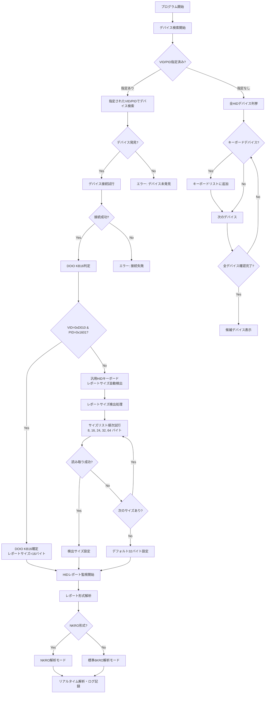
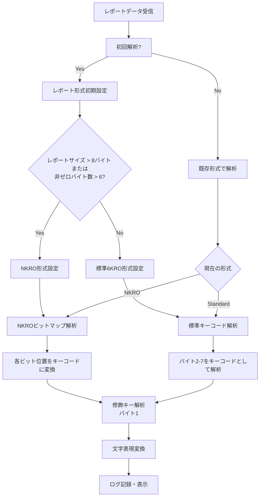

# DOIO KB16 HIDレポートアナライザー

DOIO KB16キーボードのHIDレポートを解析し、キーボード入力をリアルタイムで監視するPythonツールです。

## 機能

- DOIO KB16デバイスの自動認識
- HIDレポートのリアルタイム監視
- レポートサイズの自動検出
- 6KRO/NKRO形式の自動判別
- キーコードの文字表現への変換
- CSV/JSON形式でのログ記録

## DOIO KB16 認識ロジック

本ツールはDOIO KB16を以下のロジックで認識・解析します：



### デバイス認識の判定基準

#### 1. DOIO KB16の固有識別
- **VID (Vendor ID)**: `0xD010`
- **PID (Product ID)**: `0x1601` 
- 該当する場合は即座にDOIO KB16として認識し、16バイト固定レポートサイズを設定

#### 2. 汎用キーボードデバイスの判定
HIDデバイス列挙時に以下の条件でキーボードとして判定：
- **Usage Page**: `0x01` (Generic Desktop)
- **Usage**: `0x06` (Keyboard)
- または製品名に "keyboard" や "keypad" が含まれる場合

#### 3. レポートサイズ自動検出
DOIO KB16以外のデバイスの場合、以下の順序でレポートサイズを試行：
1. 8バイト (標準6KROキーボード)
2. 16バイト (DOIO KB16標準)
3. 24バイト
4. 32バイト 
5. 64バイト (NKROキーボード)

各サイズで1秒間の読み取りを試行し、データが取得できた最初のサイズを採用。

#### 4. レポート形式の自動判別



### レポート形式の詳細

#### 標準6KRO形式 (8バイト)
| バイト | 内容 |
|--------|------|
| 0 | 予約/無視 |
| 1 | 修飾キー (Ctrl, Shift, Alt, GUI) |
| 2-7 | 押下キーコード (最大6キー同時) |

#### NKRO形式 (16バイト以上)
| バイト | 内容 |
|--------|------|
| 0 | 予約/無視 |
| 1 | 修飾キー |
| 2以降 | 各ビットが個別キーに対応するビットマップ |

### キーコード変換

HIDキーコード (0x04-0xE7) を以下に変換：
- 英数字・記号
- ファンクションキー
- 特殊キー (矢印、Insert、Delete等)
- テンキー
- 修飾キー

Shiftキー押下状態も考慮して適切な文字を出力。

## 使用方法

### 基本的な使用方法
```bash
# DOIO KB16の自動検出・監視
python kb16_hid_report_analyzer.py

# 特定のVID/PIDを指定
python kb16_hid_report_analyzer.py --vid 0xD010 --pid 0x1601

# 接続デバイス一覧表示
python kb16_hid_report_analyzer.py --list
```

### オプション
- `--list`: 接続されているHIDデバイス一覧を表示
- `--vid`: Vendor ID (16進数)
- `--pid`: Product ID (16進数) 
- `--size`: レポートサイズ (バイト) を手動指定
- `--duration`: 監視時間 (秒) を指定
- `--output`: 出力ディレクトリを指定
- `--gui`: GUIモードで実行 (要PySide6)

## 必要なライブラリ

```bash
pip install hidapi
pip install PySide6  # GUIモード使用時のみ
```

## 出力ファイル

実行時に以下のファイルが `kb16_analysis/` ディレクトリに生成されます：

- `kb16_capture_YYYYMMDD_HHMMSS.csv`: タイムスタンプ付きHIDレポートログ
- `kb16_capture_YYYYMMDD_HHMMSS.json`: 構造化されたレポートデータ

## トラブルシューティング

### デバイスが認識されない場合
1. `--list` オプションでデバイス一覧を確認
2. VID/PIDを手動指定 (`--vid` `--pid`)
3. macOSの場合、Accessibility権限の確認

### レポートサイズが合わない場合
`--size` オプションでレポートサイズを手動指定してください。

## 実行例

### 基本実行
```bash
$ python kb16_hid_report_analyzer.py
DOIO KB16 (VID=0xD010, PID=0x1601)を検索中...
デバイスを開きました: DOIO KB16-01
シリアル番号: KB16001
DOIO KB16を検出: 16バイト固定レポートサイズを使用します

HIDレポートをリアルタイムで監視中...
Ctrl+Cで終了
------------------------------------------------------------

HIDレポート [16バイト]: 00 00 00 00 00 00 00 00 00 00 00 00 00 00 00 00
修飾キー: なし
押されているキー: なし

HIDレポート [16バイト]: 00 02 04 00 00 00 00 00 00 00 00 00 00 00 00 00
修飾キー: L-Shift 
押されているキー: 0x04
文字表現: A
```

### デバイス一覧表示
```bash
$ python kb16_hid_report_analyzer.py --list
接続されているHIDデバイスを検索中...

検出されたデバイス数: 5
------------------------------------------------------------
デバイス 1:
  ベンダーID:   0xD010
  プロダクトID: 0x1601
  製造元:       DOIO
  製品名:       KB16-01
  使用法:       0001:0006
  インタフェース番号: 0
  タイプ:       キーボード
```

## ライセンス

MIT License